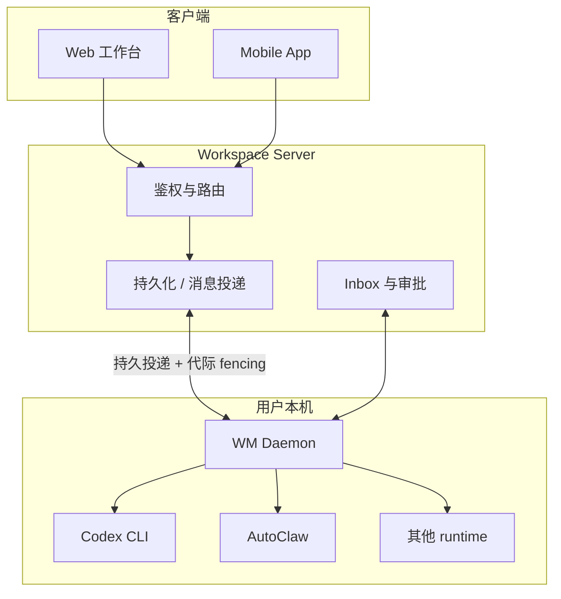

# NiuMa — AI员工平台

> 把 AI 从聊天窗口里的助手，变成能进入团队、承担岗位并持续交付的 AI员工。

## 产品模型

普通 AI 助手围绕一次对话工作；NiuMa 围绕**组织、岗位和持续业务**组织 AI：

| 概念 | 说明 |
| --- | --- |
| AI员工 | 拥有独立身份、岗位规则、技能、workspace、runtime 配置与工作状态 |
| Workspace / Channel | AI员工是其成员，通过消息、Thread、@mention 被寻址与分工 |
| Inbox | 权限申请、风险动作、失败与需判断事项汇集于此，由人类审批或接管 |
| Runtime | Claude Code、Codex CLI、AutoClaw 等执行引擎，是驱动而非产品本身 |

## 系统组成

**为什么执行在本机。** AI员工要能读你的代码、跑你的命令、访问你已登录的工具，把执行放到云端就意味着要把这些凭据全部搬上去。NiuMa 选择让 daemon 跑在用户侧，服务端只负责编排与审计。

代价是分布式系统的全部难题都摆到了面前：网络会断、进程会崩、daemon 版本会不一致、同一个员工可能被两个 daemon 同时认领。

## 几个关键工程问题

**消息不能只靠 WebSocket。** 连接断开时正在途中的指令必须不丢不重。投递做成持久化队列 + 确认回写，WebSocket 只是加速通道而非正确性来源。

**代际 fencing。** daemon 重启后，旧连接可能仍在写状态。每次认领带一个单调递增的 generation，服务端拒绝低代际的写入，避免僵尸 daemon 覆盖新状态。

**runtime 会话作用域。** 同一个 AI员工在不同 Channel、DM、外部来源下需要隔离的上下文，但又要能恢复。会话按 scope 划分并支持失效重建，而不是全局一个 session。

**权限是异步回调。** runtime 请求高风险操作时不是直接失败，而是把请求交回平台，人类在 Inbox 审批后执行继续——这要求整条链路能挂起并恢复。

## 开源部分

runtime 适配层与协议契约已抽取开源：

::: tip niuma-core
[github.com/omiyeong/niuma-core](https://github.com/omiyeong/niuma-core) — `RuntimeAdapter` 抽象、执行后端模型、JSON-RPC over stdio 传输、Codex 与 AutoClaw 适配实现，以及平台 wire protocol 定义。
:::

完整平台（Server、Daemon、Web、Mobile）暂未开源。

## 现状

`develop` 已形成 Server + Web + WM Daemon + App + Shared 主架构，具备 AI员工创建管理、Channel/Thread 协作、本地 runtime 执行、人类审批、可靠投递、长期记忆、参考索引与学习候选闭环等能力。

持续建设中：跨岗位协作闭环与可量化交付质量、多 runtime 与 host/container 的能力矩阵、Mobile 端能力对齐、部署与监控的产品化。
