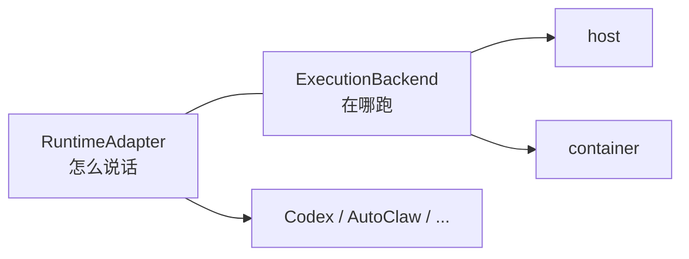

# 统一多种 Agent Runtime：一层抽象的取舍

做 AI员工平台时遇到的第一个真问题不是「怎么调模型」，而是：**平台要驱动的执行引擎不止一种，而它们彼此完全不像。**

Claude Code、Codex CLI、AutoClaw，从外面看都是「能干活的 AI agent」，但真要程序化驱动，差异大到无法忽略：

| 维度 | 差异 |
| --- | --- |
| 进程模型 | 一次性命令 · 常驻进程 · 远程 gateway |
| 传输 | stdout 文本流 · JSON-RPC over stdio · WebSocket |
| 会话 | 无状态 · 本地 session 文件 · 服务端托管会话 |
| 中断语义 | 信号终止 · 协议级 cancel · 不支持 |

平台需要的却是统一的：发起一轮执行、拿到流式输出、能中断、能恢复上下文、能知道它是否还活着。

## 第一版的错误：一个接口打天下

最直觉的做法是定义一个 `AgentAdapter`，所有 runtime 都实现它：

```ts
interface AgentAdapter {
  run(input): Promise<Result>;
  cancel(): void;
  resume(sessionId): Promise<void>;
}
```

这个设计在写第二个适配器时就崩了。

常驻进程型 runtime 的生命周期是 `start → prompt → prompt → destroy`，一次 `start` 之后可以连续多轮对话并天然复用上下文。而一次性命令型的每次执行都是独立进程，"resume" 只能靠传 session 文件路径重建。

**强行统一的结果是所有实现都退化到最小公分母**：常驻进程被迫每轮重启，白白丢掉它最大的优势。

## 第二版：两个接口 + 类型守卫

承认差异，而不是掩盖它：

```ts
// 一次性：跑完即结束
export interface RuntimeAdapter {
  readonly runtime: RuntimeId;
  run(input: RuntimeRunInput): Promise<RuntimeRunResult>;
}

// 常驻：start 一次，prompt 多次，显式销毁
export interface PersistentRuntimeAdapter {
  readonly runtime: RuntimeId;
  readonly alive: boolean;
  readonly pid?: number;
  start(input: RuntimeStartInput): Promise<void>;
  prompt(input: RuntimePromptInput): Promise<RuntimeRunResult>;
  destroy(reason?: string): Promise<void> | void;
  onExit?: (code: number | null, signal: NodeJS.Signals | null) => void;
}

export function isPersistentRuntimeAdapter(
  adapter: RuntimeAdapter | PersistentRuntimeAdapter
): adapter is PersistentRuntimeAdapter {
  const c = adapter as Partial<PersistentRuntimeAdapter>;
  return typeof c.start === "function"
    && typeof c.prompt === "function"
    && typeof c.destroy === "function";
}
```

调用方按能力分支，而不是假设所有 runtime 一样：

```ts
if (isPersistentRuntimeAdapter(adapter)) {
  await adapter.start({ agentId, cwd, systemPrompt });
  await adapter.prompt({ prompt: "分析这个仓库" });
  await adapter.prompt({ prompt: "基于上面的结论写测试" }); // 复用上下文
  await adapter.destroy("task done");
} else {
  await adapter.run({ agentId, cwd, prompt, systemPrompt });
}
```

这看起来比「一个接口」啰嗦，但它诚实：**抽象的价值在于隐藏无关差异，而不是隐藏本质差异。** 进程生命周期是本质差异，藏起来的代价是能力损失。

## 正交拆分：在哪跑 vs 怎么说话

另一个容易搞混的维度是执行环境。同一个 Codex adapter，可能跑在宿主机上，也可能跑在为每个 AI员工隔离的容器里。

如果把「容器化」做成 `ContainerCodexAdapter`，适配器数量会变成 `runtime 种类 × 后端种类`，组合爆炸。

正确的切法是让两者正交：



`ExecutionBackend` 只回答「命令在哪个环境里执行、路径怎么映射」，`RuntimeAdapter` 只回答「跟这个 runtime 用什么协议对话」。两者通过 `RuntimeRunInput.executionBackend` 组合，互不知道对方的实现。

## 权限：回调而不是异常

runtime 在执行中可能需要授权——写文件、跑命令、访问敏感资源。最省事的做法是直接失败让用户重试，但那意味着已经进行到一半的工作全部丢弃。

NiuMa 的做法是把决定权交回平台：

```ts
interface RuntimeRunInput {
  requestPermission?: (
    request: RuntimePermissionRequest
  ) => Promise<RuntimePermissionDecision>;
}
```

runtime 挂起等待，请求进入平台 Inbox，人类审批后 Promise resolve，执行继续。这要求整条链路——daemon、服务端、前端——都能承受一次可能长达数分钟的异步挂起，而不是靠超时兜底。

## 传输层要能脱离 agent 单测

`json-rpc-stdio-client.ts` 不知道 agent 的存在。它只做一件事：在 stdio 上解析 JSON-RPC 帧、配对请求与响应、处理并发 in-flight 请求。

这个边界的好处是它可以在没有任何 runtime 安装的情况下被完整单测——而 agent 适配逻辑的 bug，十有八九出在帧解析和请求配对上。

## 小结

- 抽象要隐藏无关差异，不要隐藏本质差异；生命周期是本质差异。
- 正交的维度分开建模，否则适配器数量会是乘法而不是加法。
- 需要人类介入的动作用回调挂起，不要用异常终止。
- 传输层与业务层的边界，用「能否脱离对方单测」来检验。

代码见 [github.com/omiyeong/niuma-core](https://github.com/omiyeong/niuma-core)。
